# Prova finale di Ingegneria del Software -- AA 2021-2022

## AM40 Group
### Group members: Camilla Casiraghi, Carlo Chiodaroli, Manuel Colombo
### Teacher: Alessandro Margara

This project is intended to test our cumulative skills in Software Engineering (Design, Implementation and Testing) learned in the course of three years studying the subject at Politecnico di Milano.

It consists of the implementation of [*__Eriantys__*](https://craniointernational.com/products/eriantys/) board game from *Cranio Creations* as a client-server application.

The application is written in Java 17 and the GUI uses the JavaFx 19-ea+7 runtime.

__Final Score:__ 30/30

## Implementation

|              __What__              | __Status__ |
|:----------------------------------:|:----------:|
|          Simplified Rules          |     🟢     |
| Complete Rules (8 character cards) |     🟢     |
|               Socket               |     🟢     |
|                CLI                 |     🟢     |
|                GUI                 |     🟢     |
|   __Additional Functionalities__   |     2      |
|         12 Character cards         |     🟢     |
|           4 Player Play            |     🔴     |
|           Multiple Plays           |     🔴     |
|            Persistence             |     🔴     |
|             Resilience             |     🟢     |

*🟢 Done; 🔴 Not Done*

## Actual test coverage
|   __Package__    | __Class %__ | __Method %__ | __Line %__ |
|:----------------:|:-----------:|:------------:|:----------:|
|      model       |     100     |      89      |     86     |
| controller.inner |     100     |      76      |     73     |

## Run Instructions

###Run the jar file

To run the Cli Client
<pre>java -jar AM40.jar --c</pre>

To run the Gui Client
<pre>java -jar AM40.jar --g</pre>

To run the Server
<pre>java -jar AM40.jar --s</pre>

To run the Server on a specific port
<pre>java -jar AM40.jar --s --port [port number] </pre>

### Server commands

The server only prints on screen the log of the sent and received messages.

### Cli commands

Once started the prompt will ask for server info:
<pre>
ip [address]  : to set the server's ip address (default is localhost)
port [number] : to set the server's listening port (default is 16847)
</pre>
Once connected you are asked to input your name:
<pre>
name [name] : to set the name
nickname [name] : the same as name command
</pre>
If the server accepts the connection the user can finally set play settings or customizations.

The player can set here which wizard he wants to be; he can choose one of the shown options with this command:
<pre>
wizard [KING | FAIRY | MAGICIAN | BAMBOO_GUY]
</pre>
If the user is the first to connect to the server, the server considers him as the "main Player".
This classification is used only for play creation purposes. The main player is the only player 
allowed to set the total number of players and the play's ruleset with theese commands:
<pre>
players [number]        : to set the number oh the game (accepted values are 2 and 3)
expert [true | false]   : to set the normal ruleset (false), or the expert ruleset (true)
</pre>
After all players have set their wizards and the main player has set the play settings, 
the latter one can start the game with the command:
<pre>
start   : starts the game
</pre>
At this point the game is started and is helpful to play it with the game's player handbook.

The commands to do all the possible moves in the game are:
<pre>
assistant [number]                      : in Planning phase, to play an assistant card.
studentmove [color] [from id] [to id]   : in action phase, to move a student of a color from a "from" place to a "to" place.
mnmove [#hops]                          : in action phase, to move mother nature of a certain number of hops
influence                               : in action phase, to calc the influence
choose [cloud id]                       : in action phase, to choose a cloud
</pre>
These commands are for expert ruleset games:
<pre>
character [character]                           : to play a character card. To identify her you need to use the name of the character (i.e. FRIAR)
character [character] [color]                   : the same of ca, but for those cards who need it.
character [character] [island id]               : the same of ca, but for those cards who need it.
studentmove [from color] [to color] [place id]  : is a particular student move that shifts two students one from the "Entrance" (from color) the other from the place (to color).
</pre>
Anyway the user can always use:
<pre>
help : to show the list of possible commands and abbreviations.
</pre>
### Gui commands
Once started it shows the Gui, follow the instructions to start a play.

When playing wait your turn, then you can submit your moves.
The submittable ones are:
<pre>
Play an assistant card  : choose an assistant card, then click on submit.
Move a student          : SM button, Color of student to move, From place, To place, Submit.
Switch two students     : SM button, Color of student from entrance, Color of student from other place, other place, Submit.
Move mother nature      : MNM button, island of arrival, Submit.
Calc influence          : IN button, Submit.
Choose a cloud          : CH button, select the cloud, Submit.
Play a character card   : CA button, if needed click on an island or a student, Submit.
</pre>
### Character cards commands
Sequence of commands needed to play the character cards:

| __Card Name__ | __Image__ | __Commands__ | | __Card Name__ | __Image__ | __Commands__ |
|:---------:|:------------:|:-------:|:-------:|:--------:|:-------------:|:--------:|
| Friar| 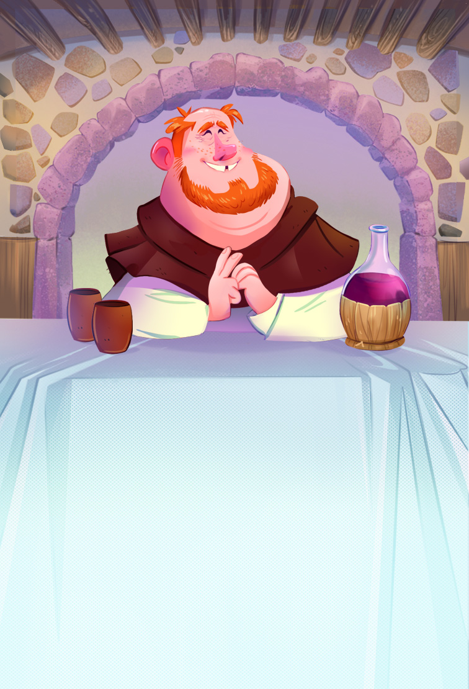 | <pre> CA, FRIAR, SUB </pre><pre> SM, Color, FRIAR, IslandId, SUB</pre> | | Jester | 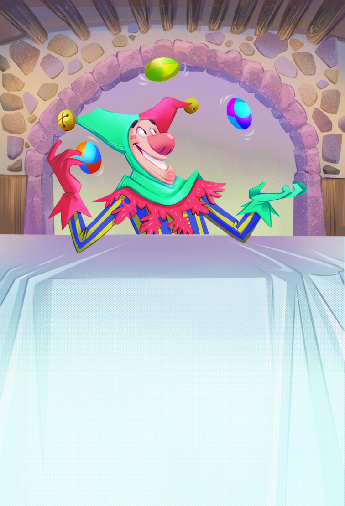 | <pre> CA, JESTER, SUB </pre><pre> SM, entranceColor, jesterColor, JESTER, SUB </pre> |
| Host | 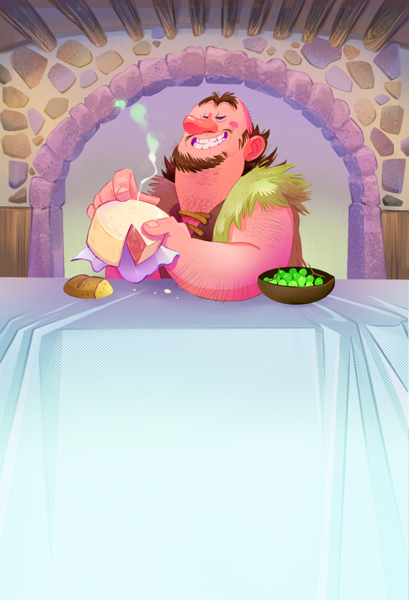 | <pre> CA, HOST, SUB </pre> | | Knight | 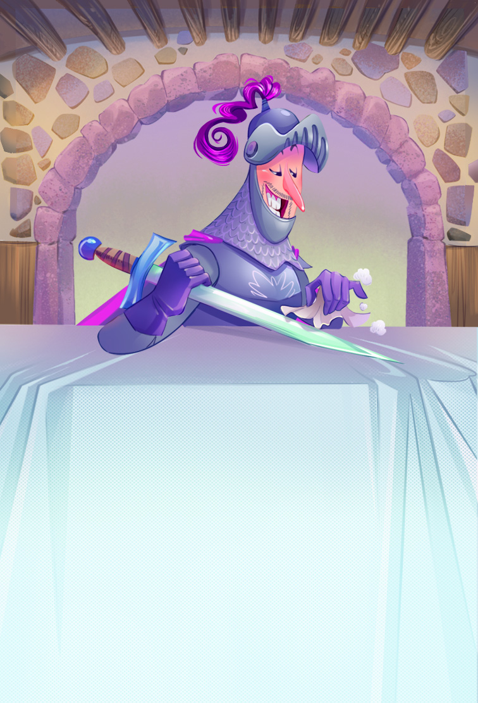 | <pre> CA, KNIGHT, SUB </pre> |
| Crier | 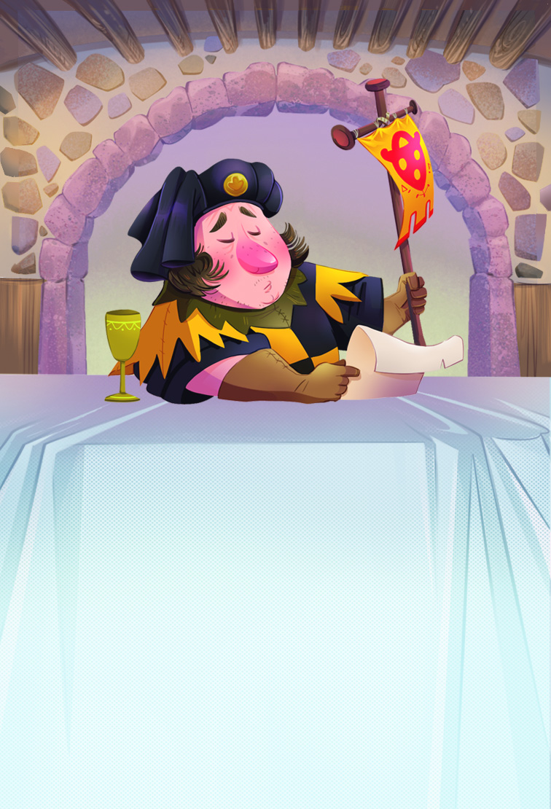 | <pre> CA, CRIER, IslandId, SUB </pre> | | Sorcerer | 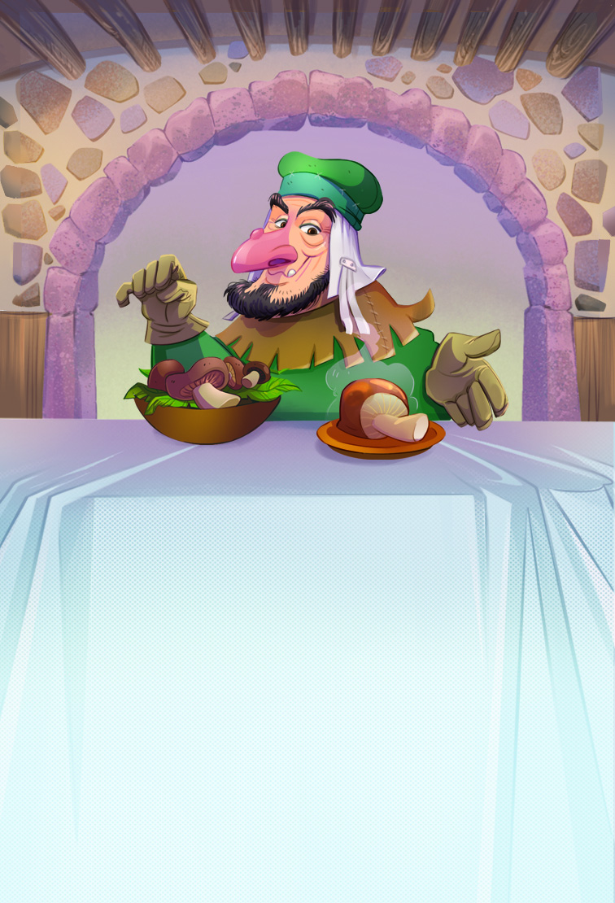 | <pre> CA, SORCERER, Color, SUB </pre> |
| Messenger | 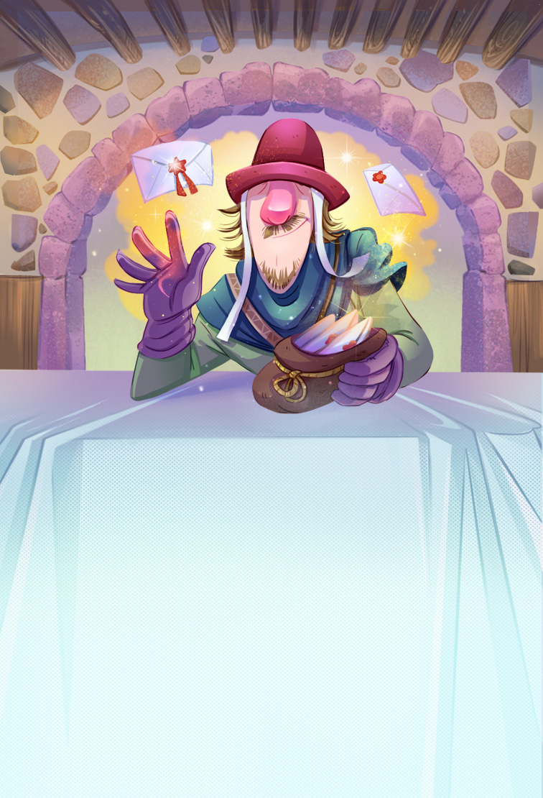 | <pre> CA, MESSENGER, SUB </pre> | | Minstrel | 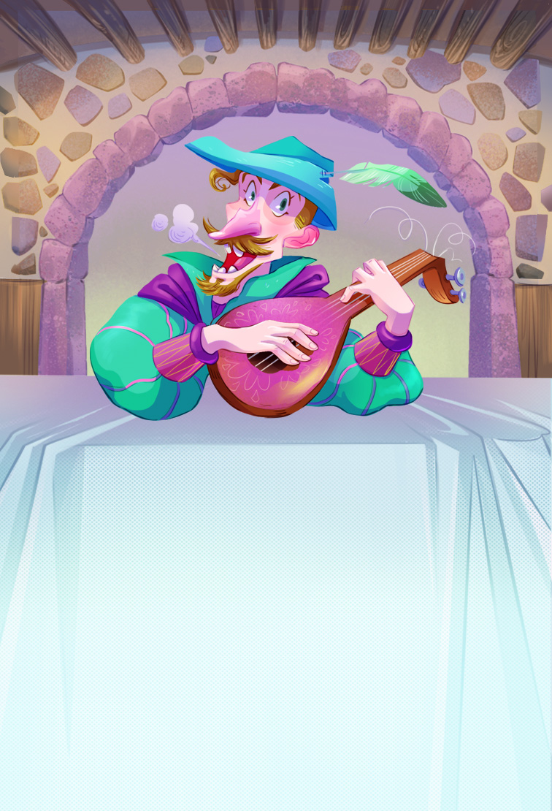 | <pre> CA, MINSTREL, SUB </pre><pre> SM, entranceColor, roomColor, Room, SUB </pre> |
| Sorceress | 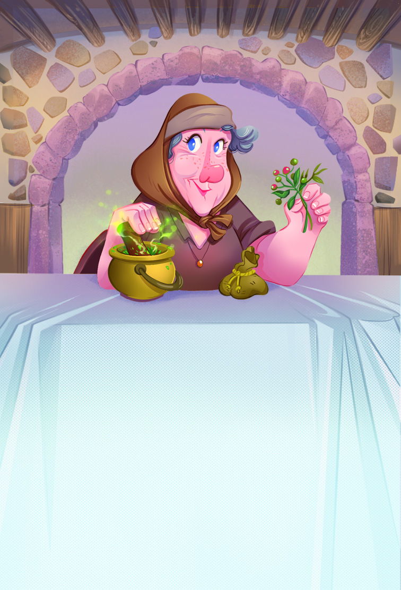 | <pre> CA, SORCERESS, IslandId, SUB </pre> | | Queen | 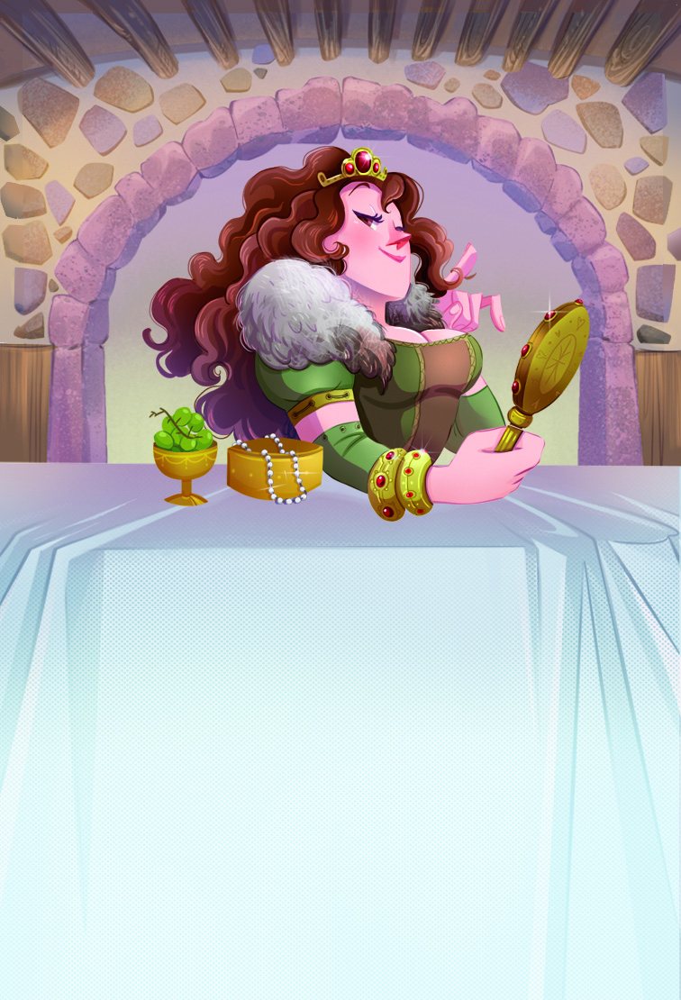 | <pre> CA, QUEEN, SUB </pre><pre> SM, Color, QUEEN, Room, SUB </pre> |
| Centaur | 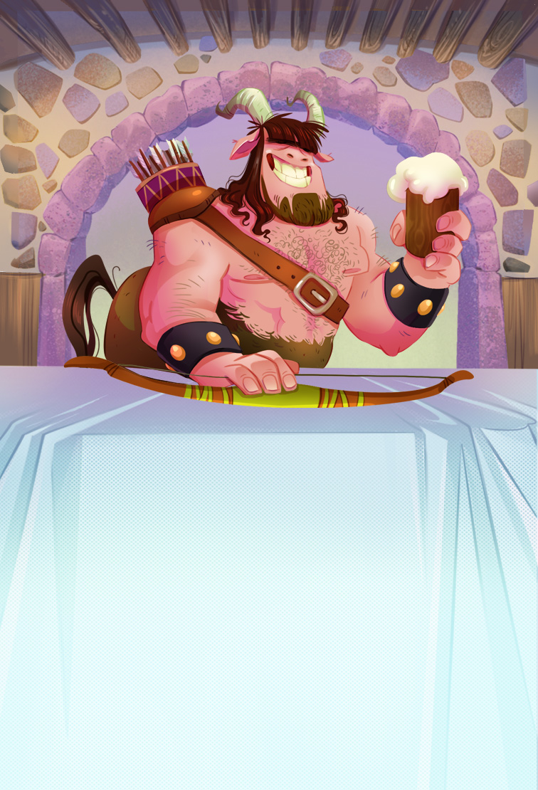 | <pre> CA, CENTAUR, SUB </pre> | | Thief | 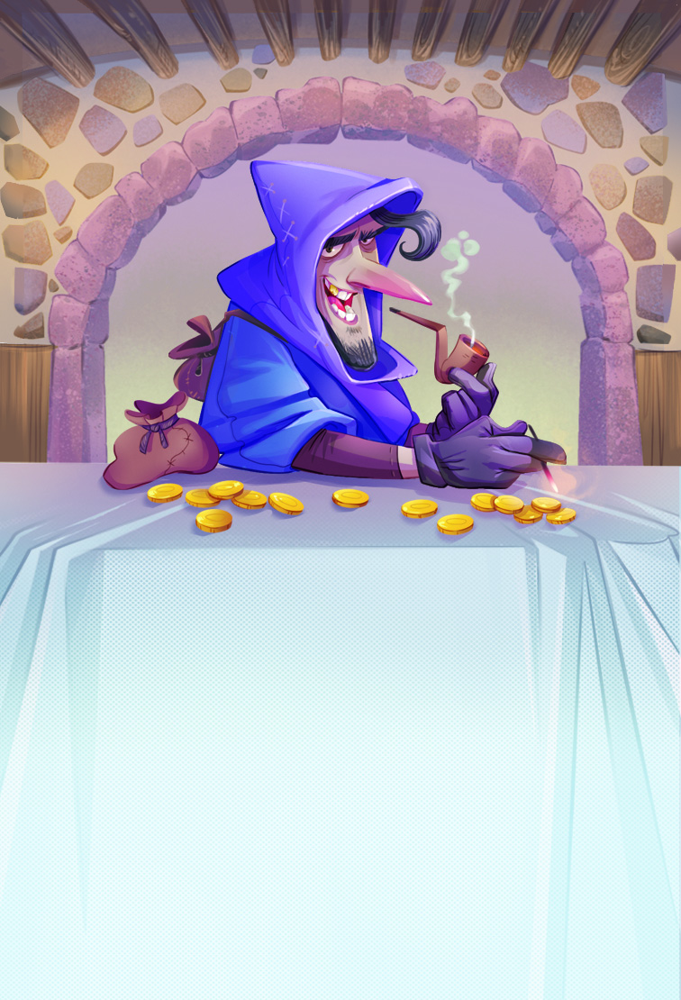 | <pre> CA, THIEF, Color, SUB </pre> |

In cli the commands are the same but without commas. 
*(SUB stands for "Submit"; it is the green SUB button in the Gui or Enter key in the Cli)*
## Project progress:

|                __Phase__                 | __Status__  |
|:----------------------------------------:|:-----------:|
|  Game model's initial UML class diagram  |    Done     |
|           Model Implementation           |    Done     |
|  *Model FA implementation and testing*   | Done (12C)  |
|        Controller implementation         |    Done     |
|   *MCV FA implementation and testing*    | Done (C.R.) |
|      Communication protocol design       |    Done     |
|  Communication protocol Implementation   |    Done     |
|          Client Implementation           |    Done     |
|                 CLI view                 |    Done     |
|                 GUI view                 |    Done     |
|||
|                 Javadoc                  |    Done     |
|        Final Application Testing         |    Done     |
| Delivery of "'deliveries' folder things" |    Done     |
|    __Final delivery__ on 30th of june    |    Done     |

*Notes:*
* *Implementation phases include singular class testing*
* *Testing phases are intended for finalizing class interaction testing*
* *Italics phases are "if we have time" phases*

